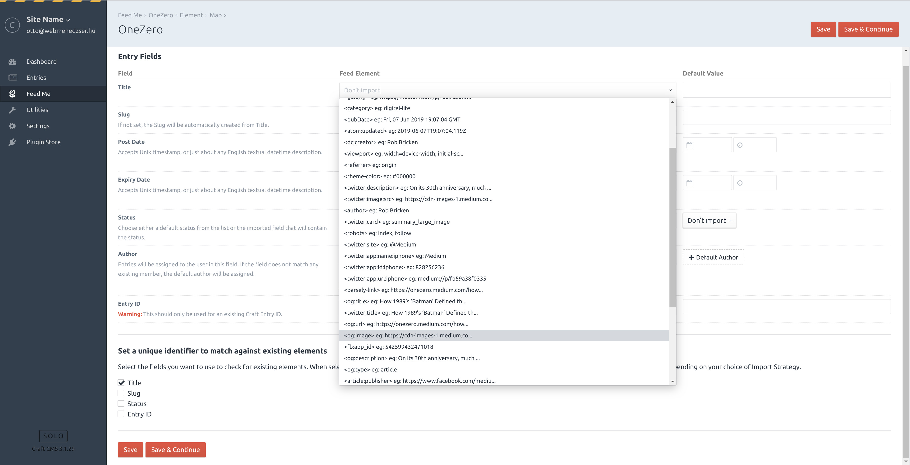

# Medium.com Meta Tag Parser for Feed Me

## Requirements

This plugin requires Craft CMS 3.0.0-RC1 and Feed Me 4.0.0 or later.

## Installation

To install the plugin, follow these instructions.

1. Open your terminal and go to your Craft project:

        cd /path/to/project

2. Then tell Composer to require the plugin:

        composer require webmenedzser/medium-com-meta-tag-parser-for-feed-me

3. In the Control Panel, go to Settings → Plugins and click the “Install” button for Medium.com Meta Tag Parser for Feed Me.

## Medium.com Meta Tag Parser for Feed Me Overview

Medium.com doesn't expose too much meta data (og:image, descriptions, etc.) for articles in their RSS feed, so you couldn't import them into Craft CMS. This plugin solves this issue: when Feed Me fetches the feed, it checks if it is a Medium.com feed. If yes, then it visits all the articles in the feed for their metadata informations and add those as additional nodes on the feed, enhancing the feed provided by Medium.com.

## Configuring Medium.com Meta Tag Parser for Feed Me

After installing the plugin just head over to Feed Me and edit your Feed's Field Mappings: if the feed is a feed from Medium.com, then the plugin will add additional nodes to the nodes extracted from the feed: you can map those nodes to any field (Asset field included) from now.

**Important note**: this plugin WILL slow down your site (when `EVENT_AFTER_FETCH_FEED` and `EVENT_AFTER_PARSE_FEED` events happen), as Craft has to fetch and parse all pages in the feed. This takes time, which is usually around 5-10 seconds.

## Using Medium.com Meta Tag Parser for Feed Me

## Medium.com Meta Tag Parser for Feed Me Roadmap

Some things to do, and ideas for potential features:

* ~~Release it~~

Brought to you by [Ottó Radics](https://www.wbmngr.agency)
